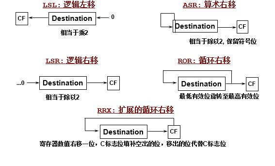
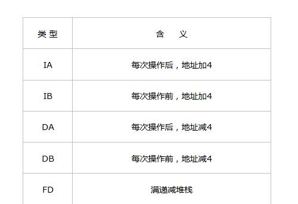
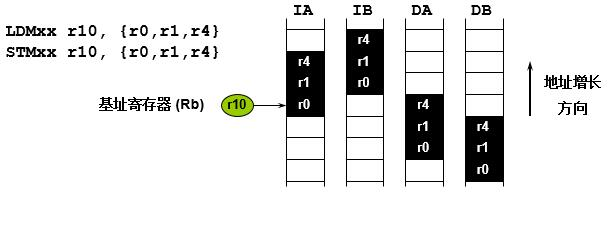
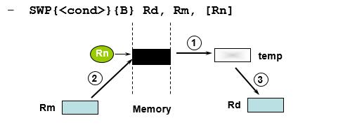
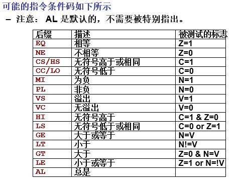
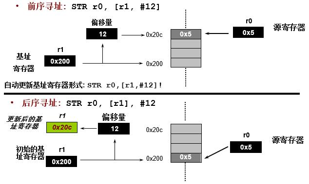

### ARM指令集整理
***
> 简介：ARM汇编指令与X86汇编指令集有比较大的区别，在此做一个简单的整理。

&nbsp;&nbsp;本文介绍的内容有： 
<ul>
  <li>数据处理指令</li>
  <li>加载、存储指令</li>
  <li>分支指令</li>
  <li>状态寄存器处理指令</li>
  <li>协处理指令</li>
  <li>异常处理指令</li>
  <li>指令执行顺序</li>
</ul>
&nbsp;&nbsp;以下做简单整理： 
#### 数据处理指令：

数据处理指令分为： 
运算类：ADD, ADC, SUB, SBC, RSB, RSC; 
逻辑类：AND, ORR, EOR, BIC; 
比较类：CMP, TST, TEQ; 
数据传输类：MOV, MVN 
数据处理类：LSL, LSR, ASR, ROR, RRX
 
&nbsp;&nbsp;ADD指令为加法指令，在ARM汇编中的格式为：
> &nbsp;&nbsp;ADD R0, R1, R2;R0 = R1 + R2; (R2也可以以为常数，在ARM汇编中的常数为带“#”的数，例如16进制的数16可以为：“#0x10”)
 

&nbsp;&nbsp;ADC指令也为加法指令，只不过于ADD加法指令不同的是，ADC为带符号位的加法指令，即在进行加法运算后再加上CPSR中的C标志位。  
&nbsp;&nbsp;SUB指令为减法指令，是ADD指令的反向运算，指令格式与ADD格式相同。  
&nbsp;&nbsp;SBC指令为ADC指令的逆运算，即在进行减法运算后再减去C标志位的值。  
&nbsp;&nbsp;RSB指令为反向减法指令，与SUB指令所不同的是他的减数和被减数是颠倒的。  
&nbsp;&nbsp;RSC指令为执行反向减法指令后再加上C符号位，在进行反向减法后再减去C符号位。
>SUB R0, R1, R2;&nbsp;&nbsp;&nbsp;R0 = R1 - R2 
RSB R0, R1, R2;&nbsp;&nbsp;&nbsp;R0 = R2 - R1

&nbsp;&nbsp;ORR指令为X86汇编指令的OR指令。  
&nbsp;&nbsp;EOR指令为异或操作，即X86汇编中的XOR指令。  
&nbsp;&nbsp;BIC为清零指令，即将目标寄存器所存值进行清零操作。  
&nbsp;&nbsp;TST指令为测试指令，与X86中的TEST指令相同。  
&nbsp;&nbsp;TEQ指令为测试相等指令，测试两个寄存器中的值是否相同。  
&nbsp;&nbsp;MVN指令也是数据转移指令，但是MVN指令要求在传送指令之前将源寄存器中的值进行取反操作后再将得到的值传入目标寄存器。  
&nbsp;&nbsp;数据处理类的指令有： LSL指令为逻辑左移指令，与X86中的SHL指令相同；  
LSR指令为逻辑右移指令，与X86中的SHR指令相同；ASR为带符号位的算术右移指令，与X86中的SCR指令相同；  
在ARM中没有循环左移指令，循环左移可以用循环右移来做到，循环右移指令为ROR；  
RRX指令为ARM特有循环移位指令，为扩展为循环右移指令。 
效果图： 

注：此处的CF即CPSR中的C位。
#### 加载、存储指令
&nbsp;&nbsp;加载、存储指令有： 
&nbsp;&nbsp;单寄存器数据传输指令：LDR，STR, LDRB, STRB, LDRH, STRH, LDRSB, LDRSH; 
&nbsp;&nbsp;批量加载、存储指令：LDMIA, STMIA, LDMIB, STMIB, LDMDA, STMDA, LDMDB, STMDB; 
&nbsp;&nbsp;栈操作指令：LDMFD, STMFD 
&nbsp;&nbsp;交换指令：SWP  
&nbsp;&nbsp;LDRX指令均为寄存器加载指令，即将一个值传入目标寄存器中，其中X位置为空时加载的是一个字大小（32位），X为B时加载一个字节（8位），X为H时加载一个半字（16位），X为SB时加载一个有符号的字节，X为SH时加载一个带符号的半字。  
&nbsp;&nbsp;STRX指令为寄存器存储指令，即将寄存器的值传出保存，与LDRX类指令相反，X位置为空时存储的是一个字大小（32位），X为B时存储一个字节（8位），X为H时存储一个半字（16位），X为SB时存储一个有符号的字节，X为SH时存储一个带符号的半字。  
LDMX与STMX类的指令均为对寄存器进行批量操作，只不过X的值不同，存储方式不同。  
  
  
&nbsp;&nbsp;对于栈操作指令，STMFD指令即为X86下的PUSH指令，LDMFD指令即为X86下的POP指令。LDMFD指令对栈空间所产生的效果与指令LDMDB相同，STMFD指令的效果与指令STMIA相同。  
&nbsp;&nbsp;对于SWP指令的效果为： 
  
即将Rm的值存入Rn所指的内存中，再将Rn所指内存原来的值存入Rd，完成对三个参数的值得交换。  
#### 分支指令
指令条件码： 
有的指令在后面还会跟两个字母，这两个字母即为执行这条指令所必须满足的条件码，条件码有：
  
> 例如有指令：MOVEQ R0, R2;当Z = 1时执行MOV指令  
只有在满足了条件码的时候指令才会执行，否则跳过指令。通过使用条件码大大减少了所需要执行的语句数量。

有条件码修饰的指令都变成了分支指令。  
跳转指令： 
ARM汇编中的跳转指令为B指令，B指令后跟随要跳转的标签等地址信息。BL指令为段跳转指令，也就是函数调用指令，通过BL指令可以跳转到其他代码段去执行相应的指令。B或者BL指令后也可以跟随条件码变成条件跳转指令。  

#### 状态寄存器处理指令
&nbsp;&nbsp;对于状态寄存器CPSR的修改，一般只需要在数据处理指令后面加上“S”就代表此指令在执行后会自动修改CPSR的相应位的值。  
&nbsp;&nbsp;在ARM汇编指令中，也可以将CPSR的当前值通过指令放置在寄存器中，或者使用寄存器的值来修改CPSR的相应位的值。  
&nbsp;&nbsp;可以将CPSR的值放入寄存器的指令为MRS，将寄存器的值放入CPSR的指令为MSR。
> 将CPSR的值放入寄存器： 
MRS R0, CPSR 
将寄存器的值来修改CPSR的C位： 
MSR CPSR_C, R0 
将寄存器中的值放入CPSR： 
MSR CPSR, R0

> 记忆方法：将CPSR或者SPSR简记为S，M记为mov，R记为寄存器（RN），且读取指令的顺序为从右到左，则MSR为从寄存器中将数据加载到状态寄存器中；MRS则是将状态寄存器的值加载到寄存器中。

#### 协处理指令
&nbsp;&nbsp;协处理器用于处理ARM处理器无法处理的额外添加的、未在ARM处理器中定义指令,如果没有相应的协处理器处理指令，将会导致未定义指令异常。 
&nbsp;&nbsp;协处理指令有以下几个： 
CDP, MRC, MCR, LDC, STC  
CDP为协处理器初始化指令，将协处理器的数据进行初始化操作。  
MRC为取值操作，为将协处理器中的数据取到ARM寄存器中。  
MCR为取值操作，为将ARM寄存器中的数据取到协处理器中。  
LDC指令为加载指令，将协处理器中的数据加载加载到内存中。  
STC指令为存储指令，与LDC指令相反，将内存中的数据加载到协处理器中。  
> 记忆方法：协处理器的标号为C，CDP指令为特例单独记忆，MRC指令中R指寄存器（RN中的R），读指令的顺序为从右到左，即将C中的数据移动（M）到R中。同样的MCR也是一样，从R中移动数据到C中。 
LDC和STC记忆更方便，已知LD为加载指令，加个C就是加载C中的数据。ST为存储指令，加个C就是将数据加载到C中。

#### 异常处理指令
&nbsp;&nbsp;异常处理指令有： 
SWI，BKPT, RFE 
SWI指令为软中断指令，通过设置软中断来让软件自陷，来切换优先级来调用操作系统的一部分高级服务，直观的就是通过调用SWI指令来让软件进行软中断。 
> 指令格式为：SWI{< cond >} < SWI number > 
其中的< cond >为条件域，< SWI number >为软中断号。  
记忆方法： SW-》swap， I-》Interrupt，连接起来就是：转换到中断位置执行

BKPT指令为断点指令，此指令被调用时将触发一个预取指令异常，将使处理器进入调试状态。
> 指令格式为：BKPT <#imm16> 
在触发中断后，#imm16这个立即数的值将会被忽略。  
记忆方法： BKPT-》BreaKPoinT

REF指令可从异常中返回，指令将Rn所指的内容加载到pc和CPSR寄存器，可选择是否对Rn进行自增回写操作。
> 语法:	RFE< DA|DB|IA|IB > Rn{!} 
DA.DB、IA、IB和之前的一样，Rn如果加上“！”则代表在执行完此指令后Rn自增一位。

#### 指令执行顺序
ARM指令通过添加一些后缀标志信息来做到改变指令顺序而且节省指令执行数目，例如在指令后添加指令条件码可以省去不少的判断跳转指令，所以除了跳转指令外，分支指令也可以改变指令的执行顺序和效果。  
此外，还有前序寻址和后序寻址也会改变指令的执行顺序。
> 以STR指令为例: 
指令STR R0， [R1, #12]达到的效果为先将R1的地址先增加12，之后再在新的地址位置所指的内存中取出值放在R0中。即先将地址增加后再取值赋值。  
指令STR R0， [R1], #12达到的效果又有所不同，此指令的动作为将R1所存的内容作为地址，取出该地址所指的内存所存储的值后将值放入R0，之后将R1增加12.即先赋值后再修改地址的位置  
要注意的是，“STR R0， [R1], #12”这条指令在执行结束后，R1的值会发生变化，而“STR R0， [R1, #12]”指令在执行后，R1的值并不会发送变化，原来是多少就是多少，如果想让R1的值在执行后发生变化，则需要在括号外添加“！”，变为：“STR R0， [R1, #12]！”这样指令执行后R1的值将会变化。  
直观解释：
